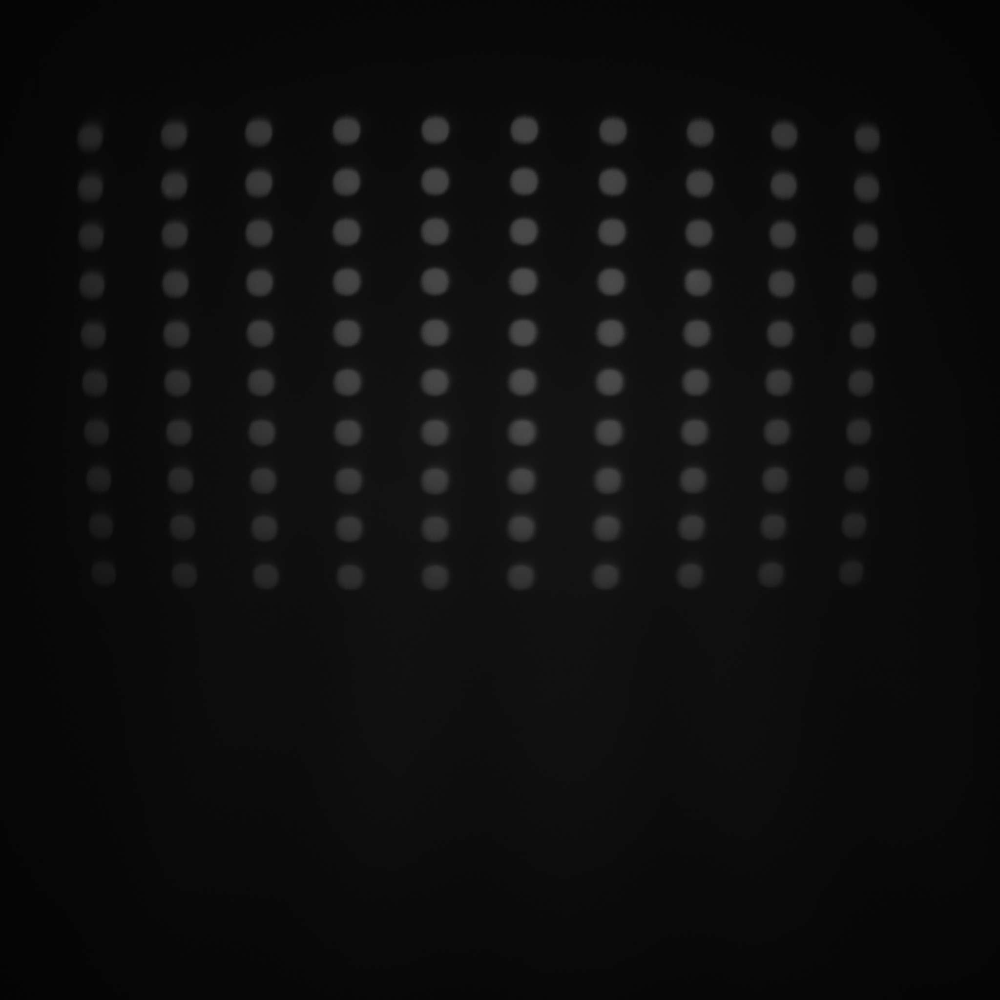
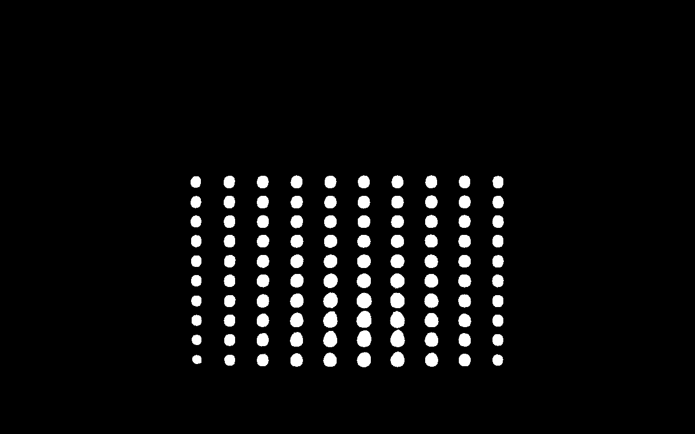
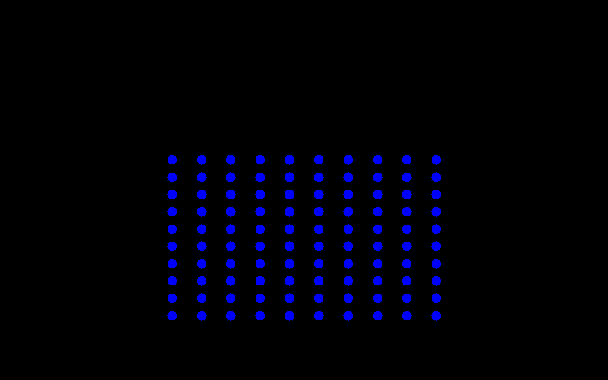

# Distortion-restore
The task is simple: restore the image from ./data/output.jpeg to ./data/input.jpeg.

## Approach:
1. locate the 100 centers of the circles on each of the images
2. learn a projection from output image to input image with (D)NN
3. use the model to do the projection from origin output.jpeg to input.jpeg to test the performance

## File organization:
1. "Image Processing.py" for locating centers
2. "Machine Learning.py" for learning the projection NN
3. "Model Validation.py" for full projection and testing performance
4. "data/" for storing learnt parameters and image data

## Details:
1. circles are located using opencv's hough find circle method
2. the points are normalized by recentering, and rescaling.
3. the NN has structure as follows:
* (x, y) normalized position input
* 100 units dense hidden layer with relu activation
* (x', y') position output, from tanh activation

## Result:
The performance is decent given a badly taken output.jpeg, and limited training pairs.

__From the original ./data/output.jpeg:__

 

__we get a restored input image:__

 

__As compared to actual input image:__

 

